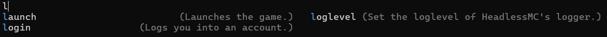

# Commands

You can list all commands available in HeadlessMc with the `help` command.

!!! tip "Suggestions and Auto-Completion"

    You can press TAB to complete commands and to get suggestions for available options.
    
    

!!! info "Arguments"

    Command Arguments are seperated by spaces.
    If you want to pass something containing spaces as a single argument,
    you need to surround it with quotation marks `"`.
    Quotation marks and spaces can also be escaped using a backslash `\`.
    
    ```
    > some command
    Read as: ['some', 'command']

    > "some command"
    Read as: ['some command']

    > "some command \"with a sentence\""
    Read as: ['some command "with a sentence"']
    ```

!!! warning "Flags & Options"

    In a questionable move it was decided that HeadlessMc would distinguish between flags
    (on/off switches) and arguments via the amount of hyphens:
    Arguments have two `--` and flags one `-`.
    ```
    > command -flag1 -flag2 --option1 "Some option" --option2 1234
    ```

#### account
=== "Usage"

    The account command can be used to list available Minecraft accounts and to select the account to use
    when launching the game.

    ``` title="Usage"
    account
    account <id/name>
    ```

=== "Arguments"
    
    | Name         | Type  | Description            |
    |--------------|-------|------------------------|
    | `<id/name>`  | `arg` | The account to select. |

=== "Examples"

    ```
    > account
    id   name
    0    3arthqu4ke
    1    SomeOtherAccount
    
    > account 1
    ...
    Account SomeOtherAccount selected.
    ```

#### config
=== "Usage"
    
    You can place `config.properties` files inside `HeadlessMC/configs`.
    Together with the default config in `HeadlessMC/config.properties`,
    these can be listed by the config command.
    It can also select a config and handle java SystemProperties.

    ``` title="Usage"
    config
    config <id/name>
    config -refresh
    config --property <system-property>
    ```

    !!! info "Configuration"

        Read more about configuration [here](configuration.md)


=== "Flags & Options"
    
    | Name         | Type     | Description                                                       |
    |--------------|----------|-------------------------------------------------------------------|
    | `<id/name>`  | `arg`    | The config to select.                                             |
    | `-refresh`   | `flag`   | Refreshes the configs folder in case new configs have been added. |
    | `--property` | `string` | Gets/sets the value of a Java SystemProperty.                     |

=== "Examples"

    ```
    > config -refresh
    > config
    id   name
    0    config
    
    > config 0
    Loading config config...

    > config --property hmc.assets.retry=3
    Set property hmc.assets.retry to 3

    > config --property hmc.assets.retry
    hmc.assets.retry = 3

    > config --property
    name                            value
    file.encoding                   UTF-8
    file.separator                  /
    java.class.path                 ...
    ```

#### download
=== "Usage"

    With `download` versions of the game can be listed and downloaded.

    ``` title="Usage"
    download
    download <id/name>
    ```

=== "Arguments"

    | Name        | Type   | Description                                                    |
    |-------------|--------|----------------------------------------------------------------|
    | `<id/name>` | `arg`  | The version to download.                                       |
    | `-refresh`  | `flag` | Refreshes the list of Minecraft versions.                      |
    | `-snapshot` | `flag` | Filters **out** snapshot versions from the list.               |
    | `-other`    | `flag` | Filters **out** other versions, like old-alphas from the list. |
    | `-release`  | `flag` | Filters **out** release versions from the list.                |

    !!! tip "Version command"

        Additionally, if specifying modloaders like `fabric:1.21.5`,
        the arguments of the modloader commands can be used.
        See [fabric](#fabric), [forge](#forge) and [neoforge](#neoforge).

=== "Examples"

    ```
    > download
    id    name                   type
    0     25w15a                 snapshot
    1     25w14craftmine         snapshot
    2     1.21.5                 release
    3     1.21.5-rc2             snapshot
    ...

    > download 1.20.6
    Downloading 1.20.6...
    Download successful!

    > download 1.20.6
    1.20.6 has already been downloaded, download anyways? (y/n)
    > n

    > download fabric:1.20.6
    Installing Fabric for version 1.20.6...
    
    download -snapshot -other
    id    name     type
    7     1.21.5   release
    23    1.21.4   release
    33    1.21.3   release
    ...
    ```

#### fabric

=== "Usage"

    With `fabric` you can install fabric for a Minecraft version.
    This is done by downloading the fabric installer jar and running it,
    using the correct java version.
    If the version is older than `1.14`, [Legacy Fabric](https://legacyfabric.net/) will be used.

    ``` title="Usage"
    fabric <id/name>
    ```

=== "Arguments"

    | Name        | Type      | Description                                                 |
    |-------------|-----------|-------------------------------------------------------------|
    | `<id/name>` | `arg`     | The version to download fabric for.                         |
    | `-inmemory` | `flag`    | Runs the installer [in-memory](in-memory.md).               |
    | `-legacy`   | `flag`    | Forces a Legacy Fabric install.                             |
    | `-forcenew` | `flag`    | Forces new Fabric to be installed instead of Legacy Fabric. |
    | `-server`   | `flag`    | Installs the fabric server.                                 |
    | `--dir`     | `string`  | Directory argument for the fabric installer.                |
    | `--java`    | `number`  | The version of Java to run the installer with.              |
    | `--jvm`     | `strings` | JVM Arguments to run the installer with.                    |
    | `--uid`     | `string`  | The version of the Fabric Loader to install.                |

=== "Examples"

    ```
    > fabric 1.21.5
    Installing Fabric for version 1.21.5...
    Loading Fabric Installer: 1.0.3
    ...
    Installed Fabric for: 1.21.5 successfully!

    > fabric 1.21.5 --uid 0.16.13 --jvm -Xmx2G --java 17
    Installing Fabric for version 1.21.5...
    ...
    Downloading library net.fabricmc:fabric-loader:0.16.13
    Done
    Installed Fabric for: 1.21.5 successfully!
    ```

#### forge
=== "Usage"

    With `forge` you can list available forge versions and install Lexforge"s forge for a Minecraft version.
    This is done by downloading the forge installer jar and running it,
    using the correct java version.

    ``` title="Usage"
    forge
    forge <id/name>
    ```

=== "Arguments"
    
    | Name        | Type      | Description                                    |
    |-------------|-----------|------------------------------------------------|
    | `<id/name>` | `arg`     | The version to download fabric for.            |
    | `-refresh`  | `flag`    | Refreshes the list of Forge versions.          |
    | `-inmemory` | `flag`    | Runs the installer [in-memory](in-memory.md).  |
    | `-server`   | `flag`    | Installs the forge server.                     |
    | `--dir`     | `string`  | Directory argument for the forge installer.    |
    | `--uid`     | `string`  | The version of forge to install.               |

=== "Examples"

    ```
    > forge
    Forge versions:
    version       uid
    1.21.5        55.0.14
    1.21.5        55.0.12
    1.21.5        55.0.11
    ...

    > forge 1.21.5
    Installing Forge 1.21.5-55.0.14
    ...
    Forge 1.21.5-55.0.14 installed successfully!

    > forge 1.21.5 --uid 55.0.12
    Installing Forge 1.21.5-55.0.12
    ...
    Forge 1.21.5-55.0.12 installed successfully!
    ```

#### help
=== "Usage"

    The help command lists commands available in HeadlessMc and can display information about them.

    ``` title="Usage"
    help
    help <command>
    help <command> <arg>
    ```

=== "Arguments"
        
    | Name        | Type  | Description                                      |
    |-------------|-------|--------------------------------------------------|
    | `<command>` | `arg` | The command to display help for.                 |
    | `<arg>`     | `arg` | The argument of the command to display help for. |

=== "Examples"

    ```
    > help
    command     description                                           args
    account     List accounts or chose the primary account.           
    config      Manage your configs.                                  -refresh
    download    Downloads a version.                                  <version/id> -id -refresh -snapshot -release -other
    ...

    > help config
    config : Manage your configs.
    arg        description
    -refresh   Reloads all configs from the disk.
    
    > help config -refresh
    config -refresh: Reloads all configs from the disk.
    ```

#### integrity
=== "Usage"

    Libraries and assets of versions can can be changed.
    The `integrity` command checks for changes in hash and file size and deletes the changed files.

    ``` title="Usage"
    integrity <version>
    ```
    
    !!! info "Integrity on Linux ARM64"

        Integrity checks for libraries on Linux ARM64 might fail,
        because HeadlessMc provides its own lwjgl binaries,
        as Mojang does not support Linux ARM64.


=== "Arguments"
    
    | Name        | Type   | Description                             |
    |-------------|--------|-----------------------------------------|
    | `<command>` | `arg`  | The version to check the integrity of.  |
    | `-assets`   | `flag` | Checks the assets of a version as well. |

    !!! tip "Version command"

        Additionally, if specifying modloaders like `fabric:1.21.5`,
        the correct version will be downloaded if it is missing.
        Then the arguments of the modloader commands can be used.
        See [fabric](#fabric), [forge](#forge) and [neoforge](#neoforge).

=== "Examples"

    ```
    > integrity 1.21.5
    ...
    Integrity check finished, 0 failed, 84 successful and 29 not found.
    ```

#### java
=== "Usage"

    The Java command lists and downloads Java versions.

    ``` title="Usage"
    java
    java <version>
    java <version> <distribution>
    ```

=== "Arguments"
    
    | Name             | Type   | Description                           |
    |------------------|--------|---------------------------------------|
    | `<version>`      | `arg`  | The version of Java to download.      |
    | `<distribution>` | `arg`  | The distribution of Java to download. |
    | `-current`       | `flag` | Displays the current Java version.    |
    | `-jdk`           | `flag` | Download a Java JDK instead of a JRE. |

=== "Examples"

    ```
    > java
    version   path                                                                   current
    21        C:/Users/me/IdeaProjects/headlessmc/HeadlessMC/java/jdk-21.0.7+6-jre   
    8         C:/Users/me/IdeaProjects/headlessmc/HeadlessMC/java/jdk8u452-b09-jre   
    23        C:/Users/me/.jdks/graalvm-ce-23.0.2                                    <------
    
    > java 17
    Downloading Java 17 100% [=======================] 43/43mb (0:00:02 / 0:00:00)

    > java 17 temurin
    Downloading Java 17 100% [=======================] 43/43mb (0:00:02 / 0:00:00)

    > java 17 temurin -jdk
    Downloading Java 17  19% [====                 ]  36/190mb (0:00:03 / 0:00:12)
    ```

#### json
=== "Usage"

    To launch the game, information on the libraries, arguments, assets etc.
    is stored in json files in `.minecraft/versions`.
    This command allows you to inspect them.

    ``` title="Usage"
    json <version>
    ```

=== "Arguments"
    
    | Name        | Type   | Description                                                                    |
    |-------------|--------|--------------------------------------------------------------------------------|
    | `<version>` | `arg`  | The version of Minecraft to display the json of.                               |
    | `-file`     | `flag` | If the first argument specified is not a version, but the path to a json file. |

    !!! tip "Version command"

        Additionally, if specifying modloaders like `fabric:1.21.5`,
        the correct version will be downloaded if it is missing.
        Then the arguments of the modloader commands can be used.
        See [fabric](#fabric), [forge](#forge) and [neoforge](#neoforge).

=== "Examples"

    ```
    > json 1.21.5
    ```
    ```json
    {
        "arguments": {
            "game": [
                "--username",
                "${auth_player_name}",
    ...
    ```

    ```
    > json fabric:1.21.5
    ```
    ```json
    {
        "inheritsFrom": "1.21.5",
        "releaseTime": "2025-05-13T21:29:56+0000",
        "mainClass": "net.fabricmc.loader.impl.launch.knot.KnotClient",
        "libraries": [
    ...
    ```

#### launch
=== "Usage"

    The launch command allows you to launch a Minecraft client version.

    ``` title="Usage"
    launch <version>
    ```

=== "Arguments"
        
    | Name           | Type      | Description                                                                                                        |
    |----------------|-----------|--------------------------------------------------------------------------------------------------------------------|
    | `<version>`    | `arg`     | The name or id of a version of Minecraft to launch.                                                                |
    | `-lwjgl`       | `flag`    | If you want to launch the game in headless mode.                                                                   |
    | `-noout`       | `flag`    | Silences output of Minecraft.                                                                                      |
    | `-specifics`   | `flag`    | Automatically downloads the [hmc-specifics](https://github.com/3arthqu4ke/hmc-specifics) for the version.          |
    | `-commands`    | `flag`    | Enables the headlessmc-runtime, a weaker version of the hmc-specifics.                                             |
    | `-inmemory`    | `flag`    | Launches the game [in-memory](in-memory.md).                                                                       |
    | `-jndi`        | `flag`    | Patches JNDI lookups in Log4J (usually always on).                                                                 |
    | `-lookup`      | `flag`    | Patches all lookups in Log4J (usually always on).                                                                  |
    | `-paulscode`   | `flag`    | Patches the paulscode sound library, which causes annoying log outputs in headless mode.                           |
    | `-prepare`     | `flag`    | Downloads everything needed to launch the game, but does not launch it.                                            |
    | `-quit`        | `flag`    | Launches the game, then quits HeadlessMc.                                                                          |
    | `-stay`        | `flag`    | Continue to use HeadlessMc after the game has been closed.                                                         |
    | `-offline`     | `flag`    | Use an offline account, in that case headless mode is enabled automatically.                                       |
    | `-keep`        | `flag`    | Keeps the files used for launching Minecraft instead of deleting them. E.g. to be used with `-quit`.               |
    | `-forceSimple` | `flag`    | If running In-Memory, prevents the use of [bootstraplauncher](https://github.com/McModLauncher/bootstraplauncher). |
    | `-forceBoot`   | `flag`    | If running In-Memory, forces the use of [bootstraplauncher](https://github.com/McModLauncher/bootstraplauncher).   |
    | `--jvm`        | `strings` | JVM arguments for Minecraft.                                                                                       |
    | `--game-args`  | `strings` | Game arguments for Minecraft, e.g. `--quickPlayMultiplayer IP:PORT`.                                               |
    | `--retries`    | `number`  | Launches the game again this many times if it fails to launch.                                                     |

    !!! tip "Version command"

        Additionally, if specifying modloaders like `fabric:1.21.5`,
        the correct version will be downloaded if it is missing.
        Then the arguments of the modloader commands can be used.
        See [fabric](#fabric), [forge](#forge) and [neoforge](#neoforge).

=== "Examples"
    
    ```
    > launch fabric:1.21.5
    ...

    > launch fabric:1.21.5 -specifics -lwjgl --jvm "-Djava.awt.headless=true -Xmx2G" --game-args "--quickPlayMultiplayer 127.0.0.1:25565"
    ...
    ```

#### login
=== "Usage"

    With `login` you can log into a Minecraft account.

    ``` title="Usage"
    login
    login <email>
    login <email> <password>
    ```

=== "Arguments"
    
    | Name         | Type   | Description                                                                                                                                                |
    |--------------|--------|------------------------------------------------------------------------------------------------------------------------------------------------------------|
    | `<email>`    | `arg`  | The email to use for logging in.                                                                                                                           |
    | `<password>` | `arg`  | The password for the email. Not recommended to specify directly, instead use `login <email>`, then enter the password when prompted, as it will be hidden. |
    | `-verbose`   | `flag` | Enables verbose log output.                                                                                                                                |
    | `-webview`   | `flag` | Logs in with a Webview. Deprecated, requires Java with JavaFx, or a jar with JavaFx.                                                                       |
    | `-cancel`    | `flag` | Cancel ongoing login processes.                                                                                                                            |

=== "Examples"

    ```
    > login
    Starting login process 0, enter 'login -cancel 0' to cancel the login process.
    Go to https://www.microsoft.com/link?otc=CQBAQ46Q
    
    > login -cancel 0
    Cancelled login process 0.

    > login test@test.com
    Enter your password or type 'abort' to cancel the login process.

    > abort
    Aborting login process.
    ```

#### loglevel
=== "Usage"

    Controls the level at which HeadlessMc logs.

    ``` title="Usage"
    loglevel <off/severe/warning/info/config/fine/finer/finest/all>
    ```

=== "Arguments"
    
    | Name         | Type   | Description                                                                                                                                                |
    |--------------|--------|------------------------------------------------------------------------------------------------------------------------------------------------------------|
    | `<level>`    | `arg`  | The Log level to log at. One of `[OFF, SEVERE, WARNING, INFO, CONFIG, FINE, FINER, FINEST, ALL]`.                                                          |

=== "Examples"

    ```
    > loglevel SEVERE
    [16:22:40] [main/OFF] [LogLevelCommand]: Logging with Level: OFF
    [16:22:40] [main/SEVERE] [LogLevelCommand]: Logging with Level: SEVERE

    > loglevel ALL
    [16:22:57] [main/OFF] [LogLevelCommand]: Logging with Level: OFF
    [16:22:57] [main/SEVERE] [LogLevelCommand]: Logging with Level: SEVERE
    [16:22:57] [main/WARNING] [LogLevelCommand]: Logging with Level: WARNING
    [16:22:57] [main/INFO] [LogLevelCommand]: Logging with Level: INFO
    [16:22:57] [main/CONFIG] [LogLevelCommand]: Logging with Level: CONFIG
    [16:22:57] [main/FINE] [LogLevelCommand]: Logging with Level: FINE
    [16:22:57] [main/FINER] [LogLevelCommand]: Logging with Level: FINER
    [16:22:57] [main/FINEST] [LogLevelCommand]: Logging with Level: FINEST
    [16:22:57] [main/ALL] [LogLevelCommand]: Logging with Level: ALL
    ```

#### memory
=== "Usage"

    Displays memory statistics.

    ``` title="Usage"
    memory
    ```

=== "Arguments"
    
    | Name | Type | Description |
    |------|------|-------------|
    | -    | -    | -           |

=== "Examples"

    ```
    > memory
    -Used:  21mb, (0.71%)
    -Free:  167mb
    -Total: 188mb
    -Max:   2988mb
    ```

#### mod

Manages mods for the Minecraft client.

``` title="Usage"
mod
mod add <version> <mod-name>
mod remove <version> <mod-name>
mod list <version>
mod search <mod-name>
mod search <mod-name> <version>
```

##### search

=== "Usage"

    Searches mods for a given term.

    ``` title="Usage"
    mod search <mod-name>
    mod search <mod-name> <version>
    ```

=== "Arguments"
        
    | Name                | Type     | Description                                                                                |
    |---------------------|----------|--------------------------------------------------------------------------------------------|
    | `<mod-name>`        | `arg`    | The search term to use.                                                                    |
    | `<version>`         | `arg`    | Restrict the search to a certain version of Minecraft.                                     |
    | `--mod-distributor` | `string` | The name of the mod distribution platform to use. Currently restricted to `Modrinth` only. |

=== "Examples"

    ```
    > mod search fabric-api
    name                   description                                                                                                                       authors
    fabric-api             Lightweight and modular API providing common hooks and intercompatibility measures utilized by mods using the Fabric toolchain.   modmuss50
    forgified-fabric-api   Fabric API implemented on top of NeoForge                                                                                         Su5eD
    reforged-fabric-api    Core API Library for Forge
    ```

##### add

=== "Usage"

    Adds a mod to a Minecraft version.

    ``` title="Usage"
    mod add <version> <mod-name>
    ```

=== "Arguments"
        
    | Name                | Type     | Description                                                                                |
    |---------------------|----------|--------------------------------------------------------------------------------------------|
    | `<version>`         | `arg`    | The version of Minecraft to install the mod for.                                           |
    | `<mod-name>`        | `arg`    | The name of the mod as it appears in the `mod search`.                                     |
    | `--mod-distributor` | `string` | The name of the mod distribution platform to use. Currently restricted to `Modrinth` only. |

    !!! tip "Version command"

        Additionally, if specifying modloaders like `fabric:1.21.5`,
        the arguments of the modloader commands can be used.
        See [fabric](#fabric), [forge](#forge) and [neoforge](#neoforge).

=== "Examples"

    ```
    >mod add fabric:1.21.5 fabric-api
    Downloaded mod fabric-api from Modrinth successfully.
    ```

##### list

=== "Usage"

    Lists mods installed for a Minecraft version.

    ``` title="Usage"
    mod list <version>
    ```

=== "Arguments"
    
    | Name          | Type     | Description                       |
    |---------------|----------|-----------------------------------|
    | `<version>`   | `arg`    | The version to list the mods for. |

    !!! tip "Version command"

        Additionally, if specifying modloaders like `fabric:1.21.5`,
        the arguments of the modloader commands can be used.
        See [fabric](#fabric), [forge](#forge) and [neoforge](#neoforge).

=== "Examples"

    ```
    > mod list fabric:1.21.5
    id   name         description                                                            authors
    0    fabric-api   Core API module providing key hooks and intercompatibility features.   FabricMC
    ```

##### remove

=== "Usage"

    Removes a mod from a Minecraft version.

    ``` title="Usage"
    mod remove <version> <mod-name>
    ```

=== "Arguments"
    
    | Name                | Type     | Description                                                                                |
    |---------------------|----------|--------------------------------------------------------------------------------------------|
    | `<version>`         | `arg`    | The version of Minecraft to remove the mod from.                                           |
    | `<mod-name>`        | `arg`    | The name or id of the mod as it appears in `mod list`.                                           |
    
    !!! tip "Version command"
    
        Additionally, if specifying modloaders like `fabric:1.21.5`,
        the arguments of the modloader commands can be used.
        See [fabric](#fabric), [forge](#forge) and [neoforge](#neoforge).

=== "Examples"

    ```
    > mod remove fabric:1.21.5 fabric-api
    Mod 'fabric-api' deleted successfully.
    ```

#### multi

=== "Usage"

    Run multiple commands in one.
    This is e.g. useful, if you start HeadlessMc with `--command` to specify a singular command to be executed.

    ``` title="Usage"
    multi <command1> <command2> ...
    ```

=== "Arguments"
    
    | Name                | Type     | Description         |
    |---------------------|----------|---------------------|
    | `<command>`         | `arg`    | The command to run. |

=== "Examples"

    ```
    > multi java "versions -refresh"
    version   path                                                                   current
    23        C:/Users/me/.jdks/graalvm-ce-23.0.2                                    <------
    id   name                           parent
    0    1.12.2                         
    ...
    ```

#### neoforge
=== "Usage"

    With `neoforge` you can list available neoforge versions and install Neoforge for a Minecraft version.
    This is done by downloading the neoforge installer jar and running it,
    using the correct java version.

    ``` title="Usage"
    neoforge
    neoforge <id/name>
    ```

=== "Arguments"
    
    | Name        | Type      | Description                                    |
    |-------------|-----------|------------------------------------------------|
    | `<id/name>` | `arg`     | The version to download fabric for.            |
    | `-refresh`  | `flag`    | Refreshes the list of neoforge versions.       |
    | `-inmemory` | `flag`    | Runs the installer [in-memory](in-memory.md).  |
    | `-server`   | `flag`    | Installs the neoforge server.                  |
    | `--dir`     | `string`  | Directory argument for the neoforge installer. |
    | `--uid`     | `string`  | The version of neoforge to install.            |

=== "Examples"

    ```
    > neoforge
    NeoForge versions:
    version          uid
    1.20.1           47.1.106
    1.20.1           47.1.105
    1.20.1           47.1.104
    ...

    > neoforge 1.21.5
    Installing NeoForge 1.21.5-21.5.66-beta
    ...
    NeoForge 1.21.5-21.5.66-beta installed successfully!

    > neoforge 1.21.5 --uid 21.5.65-beta
    Installing NeoForge 1.21.5-21.5.65-beta
    ...
    NeoForge 1.21.5-21.5.65-beta installed successfully!
    ```

#### offline

=== "Usage"

    Toggles offline mode.
    The game can only be launched in headless mode.
    Offline mode does not persist between HeadlessMc launches.

    ``` title="Usage"
    offline
    offline <true/false>
    ```

=== "Arguments"
    
    | Name      | Type     | Description                                                             |
    |-----------|----------|-------------------------------------------------------------------------|
    | `<value>` | `arg`    | `true` or `false` depending if you want to turn offline mode on or off. |

=== "Examples"

    ```
    > offline
    You are now offline.

    > offline
    You are now online.

    > offline true
    You are now offline.

    > offline false
    You are now online.
    ```

#### password

=== "Usage"

    Toggles password mode.
    If on, it will hide all inputs made to the console.
    On some terminals, e.g. IntelliJ, there is no support for this.
    Password mode does not persist between HeadlessMc launches.

    ``` title="Usage"
    password
    ```

=== "Arguments"
    
    | Name | Type | Description |
    |------|------|-------------|
    | -    | -    | -           |

=== "Examples"

    ```
    > password
    Enabled password mode.

    > password
    Disabled password mode.
    ```

#### plugins

=== "Usage"
    
    Lists installed [plugins](plugins.md).
    
    ``` title="Usage"
    plugins
    ```

=== "Arguments"

    | Name | Type | Description |
    |------|------|-------------|
    | -    | -    | -           |

=== "Examples"

    ```
    > plugins
    name     description
    meteor   Adds a command for downloading meteor.
    ```

#### quit

=== "Usage"

    Exits HeadlessMc.
    
    ``` title="Usage"
    quit
    exit
    stop
    ```

=== "Arguments"

    | Name | Type | Description |
    |------|------|-------------|
    | -    | -    | -           |

=== "Examples"

    ```
    > quit
    Bye!
    ```

#### server

Manages servers. See also [here](servers.md).

``` title="Usage"
server
server add <type>
server add <type> <version>
server add <type> <version> <name>
server add <type> <version> <name> <build>
server list
server launch <name>
server remove <name>
server eula <name>
server eula <name> accept
server mod
server mod add <name> <mod-name>
server mod remove <name> <mod-name>
server mod list <name>
server mod search <mod-name>
server mod search <mod-name> <version>
```

##### add

=== "Usage"

    Adds a Minecraft server.

    ``` title="Usage"
    server
    server add <type>
    server add <type> <version>
    server add <type> <version> <name>
    server add <type> <version> <name> <build>
    ```

=== "Arguments"
    
    | Name                | Type     | Description                                                                                |
    |---------------------|----------|--------------------------------------------------------------------------------------------|
    | `<type>`            | `arg`    | The type of server to add (`paper`, `purpur`, `fabric`, `vanilla`, etc.).                  |
    | `<version>`         | `arg`    | The version of Minecraft to install add a server for.                                      |
    | `<name>`            | `arg`    | A name for the server.                                                                     |
    | `<build>`           | `arg`    | A specific version of the server software.                                                 |

    !!! tip "Modloader Installation"

        Fabric and Forge versions are installed using their installers,
        so the arguments of the respective modloader commands can be used.
        See [fabric](#fabric), [forge](#forge) and [neoforge](#neoforge).

=== "Examples"

    ```
    >server add paper 1.21.5
    Adding paper server for 1.21.5
    Added paper server: paper-1.21.5-77.
    ```

##### list

=== "Usage"

    Lists servers.

    ``` title="Usage"
    server list
    ```

=== "Arguments"
    
    | Name | Type | Description |
    |------|------|-------------|
    | -    | -    | -           |

=== "Examples"

    ```
    > server list
    id   type    version   name
    0    paper   1.21.5    paper-1.21.5-77
    ```

##### remove

=== "Usage"

    Removes a server.

    ``` title="Usage"
    server remove <name>
    ```

=== "Arguments"
    
    | Name         | Type     | Description                                            |
    |--------------|----------|--------------------------------------------------------|
    | `<name>`     | `arg`    | The name or id of the server to remove.                |

=== "Examples"

    ```
    > server remove paper-1.21.5-77
    Removed server 'paper-1.21.5-77'.
    ```

##### eula

=== "Usage"

    View/Accepts the EULA for a server.
    This might launch the server once if no EULA is available.
    The default server behaviour will then create a EULA for us to accept.

    ``` title="Usage"
    server eula <name>
    server eula <name> accept
    ```

=== "Arguments"
    
    | Name         | Type     | Description                                               |
    |--------------|----------|-----------------------------------------------------------|
    | `<name>`     | `arg`    | The name or id of the server to accept/view the EULA of.  |

    !!! tip "Modloader Installation"
    
        To get the EULA if it does not exist the server might get launched.
        All arguments of the [server launch](#launch_1) command can be used.

=== "Examples"

    ```
    > server eula paper-1.21.5-77
    #By changing the setting below to TRUE you are indicating your agreement to our EULA (https://aka.ms/MinecraftEULA).
    #Wed May 14 19:19:35 AEST 2025
    eula=false

    > server eula paper-1.21.5-77 accept
    EULA accepted.

    > server eula paper-1.21.5-77
    ...
    eula=true
    ```

##### launch

=== "Usage"

    Launches the server.

    ``` title="Usage"
    server launch <name>
    ```

=== "Arguments"
    
    | Name         | Type     | Description                               |
    |--------------|----------|-------------------------------------------|
    | `<name>`     | `arg`    | The name or id of the server to launch.   |

    !!! tip "Launch Command"
    
        Almost all flags and options from the [launch](#launch) command can be used.
        Some server types like Forge start the server with a script,
        for those e.g. `-inmemory` is unsupported.

=== "Examples"

    ```
    > server launch paper-1.21.5-77
    [19:28:21 INFO]: Done (25.376s)! For help, type "help"
    > stop
    [19:28:30 INFO]: Stopping the server
    ...    
    ```

#### specifics

=== "Usage"

    Manages HeadlessMc version specific mods.
    - [hmc-specifics](https://github.com/3arthqu4ke/hmc-specifics)
    - [hmc-optimizations](https://github.com/3arthqu4ke/hmc-optimizations)
    - [mc-runtime-test](https://github.com/headlesshq/mc-runtime-test)

    ``` title="Usage"
    specifics
    specifics <version> hmc-specifics
    specifics <version> hmc-optimizations
    specifics <version> hmc-runtime-test
    ```

=== "Arguments"
    
    | Name        | Type     | Description                                                     |
    |-------------|----------|-----------------------------------------------------------------|
    | `<version>` | `arg`    | The name or id of the version to install the specifics mod for. |

    !!! tip "Version command"

        Additionally, if specifying modloaders like `fabric:1.21.5`,
        the arguments of the modloader commands can be used.
        See [fabric](#fabric), [forge](#forge) and [neoforge](#neoforge).

=== "Examples"

    ```
    > specifics
    name                version   url
    hmc-specifics       2.2.0     https://github.com/3arthqu4ke/hmc-specifics/releases/download/
    mc-runtime-test     3.1.0     https://github.com/headlesshq/mc-runtime-test/releases/download/
    hmc-optimizations   0.4.0     https://github.com/3arthqu4ke/hmc-optimizations/releases/download/

    > specifics fabric:1.21.5 hmc-specifics
    Installed hmc-specifics-2.2.0 for fabric-loader-0.16.14-1.21.5 successfully.
    ```

#### versions

=== "Usage"

    Lists Minecraft client versions.
    
    ``` title="Usage"
    versions
    ```

=== "Arguments"
    
    | Name       | Type   | Description                                                                                |
    |------------|--------|--------------------------------------------------------------------------------------------|
    | `-refresh` | `flag` | Refreshes the version folder to find versions that have been added since the last refresh. |

=== "Examples"

    ```
    > versions
    id   name                           parent
    0    1.12.2                         
    1    1.12.2-forge-14.23.5.2860      1.12.2
    ...
    ```
