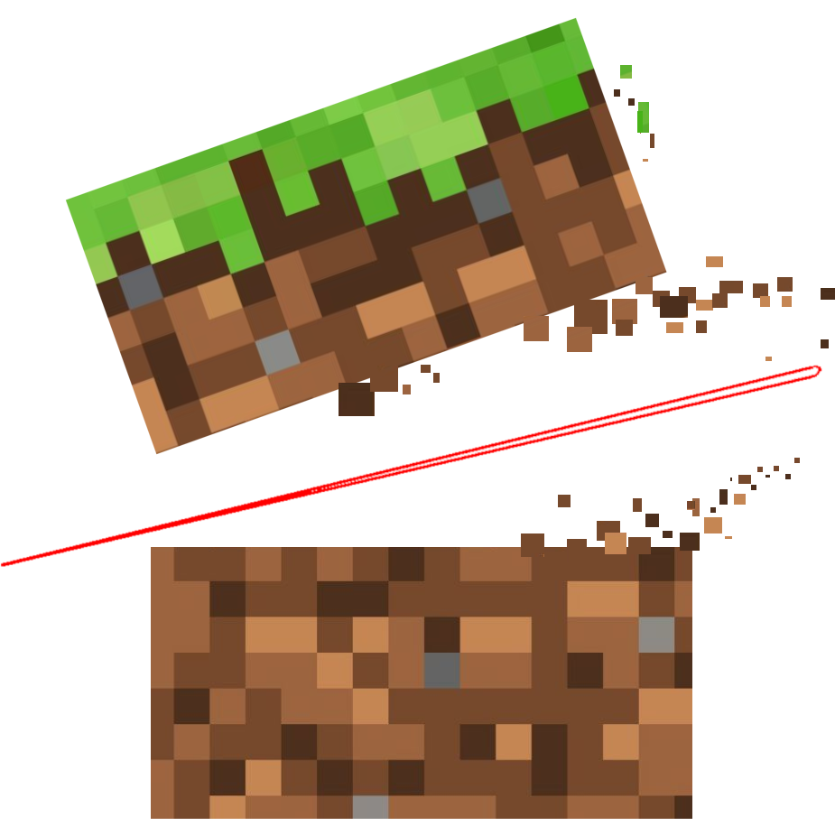

<!--suppress HtmlDeprecatedAttribute -->
<h1 align="center" style="font-weight: normal;"><b>HeadlessMc</b></h1>

A command line launcher for Minecraft Java Edition.

!!! warning "Legal Notice"

    NOT AN OFFICIAL MINECRAFT PRODUCT. NOT APPROVED BY OR ASSOCIATED WITH MOJANG OR MICROSOFT.

    HeadlessMc will not allow you to play without having bought Minecraft!
    Accounts will always be validated.
    Offline accounts can only be used to run the game headlessly in CI/CD pipelines.

HeadlessMc (HMC) allows you to launch Minecraft Java Edition from the command line.
It can manage clients, servers and mods.
It can run the client in headless mode, without a Screen, controlled by the command line.
This e.g. can allow you to test the game in your CI/CD pipeline with [mc-runtime-test](https://github.com/headlesshq/mc-runtime-test).

If you are ready, read [Getting Started](getting-started.md).
