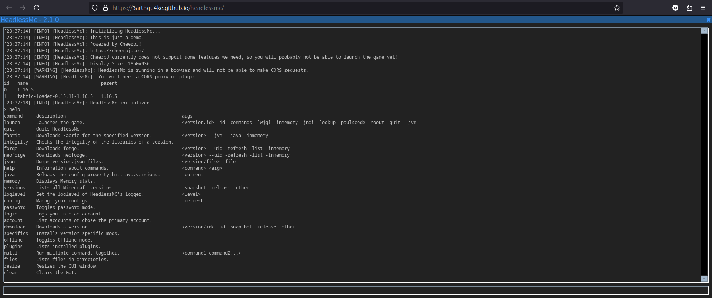
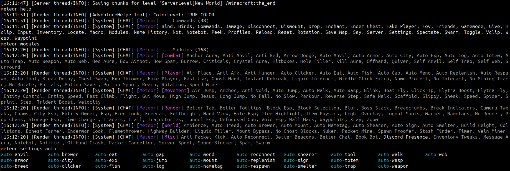
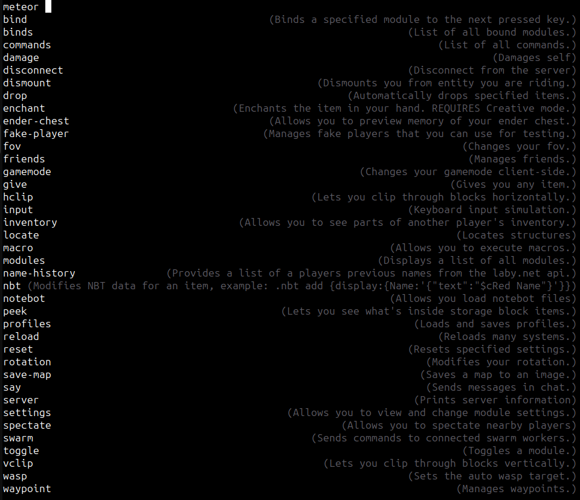

# Plugins

You can place plugins in `HeadlessMC/plugins`.
Currently, there are not many plugins.

### GUI Plugin
A simple GUI plugin can be found in `headlessmc-web`.
It is used for the browser version of HeadlessMc.

### Meteor Plugin
A plugin that both interfaces with the launcher and with the hmc-specifics
can be found [here](https://github.com/3arthqu4ke/hmc-meteor).

A 1.21.1 meteor Addon that adds a command for executing meteor commands in game to the hmc-specifics. 
Also acts as a plugin for the HeadlessMc launcher, 
where it also adds a meteor command, to download the latest version of meteor.

