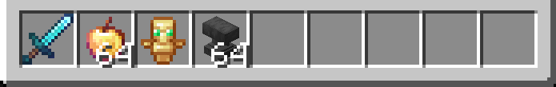
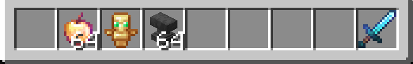
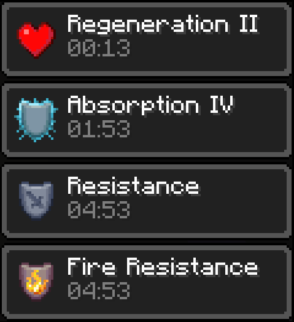

# Specifics

HeadlessMc does not depend on any specific Minecraft version.
However, some things can only be achieved by writing mods specific to each version.
One of the main features of HeadlessMc is,
that it can send commands to the running Minecraft client,
a feature not found in any other Minecraft launcher.
With a version specific mod that runs in the game and listens to the commands,
we can control the game from the command line,
even if it runs in headless mode without a screen.

### HMC-Specifics

The [hmc-specifics](https://github.com/3arthqu4ke/hmc-specifics)
are a set of `fabric`, `forge` and `neoforge` mods for most major versions of Minecraft.
They add command line support from HeadlessMc to it.

You can download the correct hmc-specifics version from Github,
or use the `specifics` command in HeadlessMc:
```
> versions
id   name                          parent                       
0    1.21.5                         
1   neoforge-21.5.66-beta          1.21.5

> specifics 1 hmc-specifics
Installed hmc-specifics-2.2.0 for neoforge-21.5.66-beta successfully.

> launch 1
...
```
Once Minecraft has loaded, you can use `help` to get a list of commands you can use:
```
command      description                                
quit         Quits the running game.                    
help         Information about commands.               
render       Outputs all text rendered on the screen.   
click        Performs clicks in the Gui.                
gui          Dumps the currently displayed screen.      
text         Set text in text fields.                   
close        Closes the current screen, if ingame.      
menu         Opens the menu if you are ingame.          
memory       Displays Memory stats.                     
connect      Connects you to a server.                  
disconnect   Disconnects you from a server.             
login        Logs you into an account.                  
key          Allows you to press keys.                  
msg          Sends a chat message.                      
/            Sends a chat command.                      
.            Sends a chat message.      
```

##### GUIs
With `gui` you can dump the screen that is currently displayed by Minecraft.
```
> gui
Screen: net.minecraft.client.gui.screens.TitleScreen
Buttons:
id   text                                      x     y     w     h    on   type
0    Multiplayer                               113   116   200   20   1    Button
1    Singleplayer                              113   92    200   20   1    Button
2    Minecraft Realms                          113   140   200   20   1    Button
3    Mods                                      113   164   200   20   1    ModsButton
4    Language...                               89    200   20    20   1    CenteredIcon
5    Options...                                113   200   98    20   1    Button
6    Quit Game                                 215   200   98    20   1    Button
7    Accessibility Settings...                 317   200   20    20   1    CenteredIcon
8    Copyright Mojang AB. Do not distribute!   229   230   196   10   1    PlainTextButton
TextFields:
id   text   x   y   w   h   type
-    -      -   -   -   -   -
```
As you can see we are currently on the title screen of Minecraft, let's change that.
With `click` we can click gui elements.
Let's click the `Singleplayer` button. 
```
> click 1
Clicking at x=213, y=102, button=0
```
Afterward, let's use `gui` again, we are now on the screen that lets us create a new SinglePlayer world.
This is because we are on Neoforge 1.21.5 and have no worlds,
on other versions we might have to click through the screen that lets us select our worlds first.
```
> gui
Screen: net.minecraft.client.gui.screens.worldselection.CreateWorldScreen
Buttons:
id   text               x     y     w     h    on   type
0    Cancel             217   214   150   20   1    Button
1    Create New World   59    214   150   20   1    Button
TextFields:
id   text        x     y    w     h    type
2    New World   109   48   208   20   EditBox
Other:
id   text                  x     y     w     h    type
3    World Name            109   35    55    9    StringWidget
4    Game Mode: Survival   108   76    210   20   CycleButton
5    Difficulty: Normal    108   104   210   20   CycleButton
6    Allow Commands: OFF   108   132   210   20   CycleButton
```

##### Text
We can give our world a name by using the `text` command to fill out the `New World` text field.
```
> text 2 "Name for our world"
```
Let's create and join a new world by clicking the `Create New World` button:
```
> click 1
Clicking at x=134, y=224, button=0
[19:54:53] [Server thread/INFO] [minecraft/IntegratedServer]: Starting integrated minecraft server version 1.21.5
...
[19:55:03] [Server thread/INFO] [minecraft/PlayerList]: 3arthqu4ke[local:E:62792f56] logged in with entity id 26 at (-4.5, 58.0, 15.5)
[19:55:03] [Server thread/INFO] [minecraft/MinecraftServer]: 3arthqu4ke joined the game
...
> gui
Minecraft is currently not displaying a Gui.
```
Nice, we have joined the world, Minecraft is not displaying any screens.

##### Chat
You can use `.` or `msg` to send a message, and `/` to send a command:
```
> . Hello World! 
[21:05:04] [Render thread/INFO] [minecraft/ChatComponent]: [CHAT] <3arthqu4ke> Hello World!

> /gamemode creative
[21:05:31] [Render thread/INFO] [minecraft/ChatComponent]: [System] [CHAT] Set own game mode to Creative Mode
```

##### Inventory
We can open our Inventory by using:
```
> menu -inventory
Opening inventory...
```
Let's assume we have played a little, then we are going to have some items in our inventory.
The `gui` command will also output the inventory slots.
We are wearing armor and have some items in our hotbar:
<div class="md-code__content" style="background: #282a36; padding: 1em; border-radius: 8px;">
  <code>Screen: net.minecraft.client.gui.screens.inventory.InventoryScreen</code>
  <code>...</code>
  <code style="white-space: pre;">id   text                       x     y     w    h    type</code>
  <code style="white-space: pre;">0                               306   84    18   18   Slot</code>
  <code style="white-space: pre;">...</code>
  <code style="white-space: pre;">5    <span style="color:white;">[Diamond Helmet]</span>           160   64    18   18   Slot</code>
  <code style="white-space: pre;">6    <span style="color:white;">[Diamond Chestplate]</span>       160   82    18   18   Slot</code>
  <code style="white-space: pre;">7    <span style="color:white;">[Diamond Leggings]</span>         160   100   18   18   Slot</code>
  <code style="white-space: pre;">8    <span style="color:white;">[Diamond Boots]</span>            160   118   18   18   Slot</code>
  <code style="white-space: pre;">...</code>
  <code style="white-space: pre;">36   [Diamond Sword]            160   198   18   18   Slot</code>
  <code style="white-space: pre;">37   <span style="color:aqua;">[Enchanted Golden Apple]</span>   178   198   18   18   Slot</code>
  <code style="white-space: pre;">38   <span style="color:gold;">[Totem of Undying]</span>         196   198   18   18   Slot</code>
  <code style="white-space: pre;">39   <span style="color:white;">[Anvil]</span>                    214   198   18   18   Slot</code>
  <code style="white-space: pre;">40                              232   198   18   18   Slot</code>
  <code style="white-space: pre;">...</code>
</div>



With `click` we can also move around items in our inventory:
```
> click 36
> click 44
```



With `gui --tooltip` we can get the tooltip of an item:
<div class="md-code__content" style="background: #282a36; padding: 1em; border-radius: 8px;">
  <code>> gui --tooltip 36 </code>
  <code style="white-space: pre;"><span style="color:aqua;">Diamond Sword</span></code>
  <code style="white-space: pre;"><span style="color:dimgray;">Sharpness V</span></code>
  <code style="white-space: pre;"><span style="color:dimgray;">Unbreaking III</span></code>
  <code style="white-space: pre;"><span style="color:dimgray;">Mending</span></code>
  <code style="white-space: pre;"><span style="color:aqua;"> </span></code>
  <code style="white-space: pre;"><span style="color:dimgray;">When in Main Hand:</span></code>
  <code style="white-space: pre;"><span style="color:green;"> 7 Attack Damage</span></code>
  <code style="white-space: pre;"><span style="color:green;"> 1.6 Attack Speed</span></code>
</div>

With `close` you can close open menus.
`menu` alone opens the in-game menu for pausing the game.

##### Hidden Strings
Some strings cannot be found by the `gui` command.
But you can dump all strings rendered by the Minecraft client with the `render` command.
Potion effects in the inventory are not displayed by `gui`, but `render` makes them visible:

<div class="grid" markdown>

```
> render
{x=177.0, y=268.0, text=64}
{x=238.0, y=243.0, text=8}
{x=97.0, y=6.0, text=Crafting}
{x=358.0, y=62.0, text=Regeneration II}
{x=358.0, y=72.0, text=00:13}
{x=358.0, y=95.0, text=Absorption IV}
{x=358.0, y=105.0, text=01:53}
{x=358.0, y=128.0, text=Resistance}
{x=358.0, y=138.0, text=04:53}
{x=358.0, y=161.0, text=Fire Resistance}
{x=358.0, y=171.0, text=04:53}  
```
    


</div>

##### Keys and Screenshots
To simulate a key press use the `key` command.
This way you can e.g. take a screenshot:
```
> key f2
[21:20:51] [Render thread/INFO] [minecraft/ChatComponent]: [System] [CHAT] Saved screenshot as 2025-05-14_21.20.50.png
```
With `--duration` you can specify the time until the key is released.
With `-release` you can simulate the key release.

##### Servers
With the `login` command you can log into an account.
This works similarly to the [login](commands.md/#login) command of HeadlessMc.
HMC-Specifics attempts to automatically refresh your account every 24 hours,
as that is when the token for authentication with servers runs out.

With `connect` you can connect to a server:
```
> connect hypixel.net
```
With `disconnect` you can disconnect from a server.

#### Supported versions
Hmc-specifics support the following versions of Minecraft:

|    Version    |        Forge        |       Fabric       |      NeoForge      |
|:-------------:|:-------------------:|:------------------:|:------------------:|
|  1.21-1.21.5  | :white_check_mark:  | :white_check_mark: | :white_check_mark: |
|    1.20.6     | :white_check_mark:  | :white_check_mark: | :white_check_mark: |
| 1.20.1-1.20.4 |         :x:         |        :x:         |       :x:          |
|    1.19.4     | :white_check_mark:  | :white_check_mark: |         -          |
|    1.18.2     | :white_check_mark:  | :white_check_mark: |         -          |
|    1.17.1     | :white_check_mark:  | :white_check_mark: |         -          |
|    1.16.5     | :white_check_mark:  | :white_check_mark: |         -          |
|    1.12.2     | :white_check_mark:  | :white_check_mark: |         -          |
|     1.8.9     | :white_check_mark:  | :white_check_mark: |         -          |
|    1.7.10     | :white_check_mark:  | :white_check_mark: |         -          |
